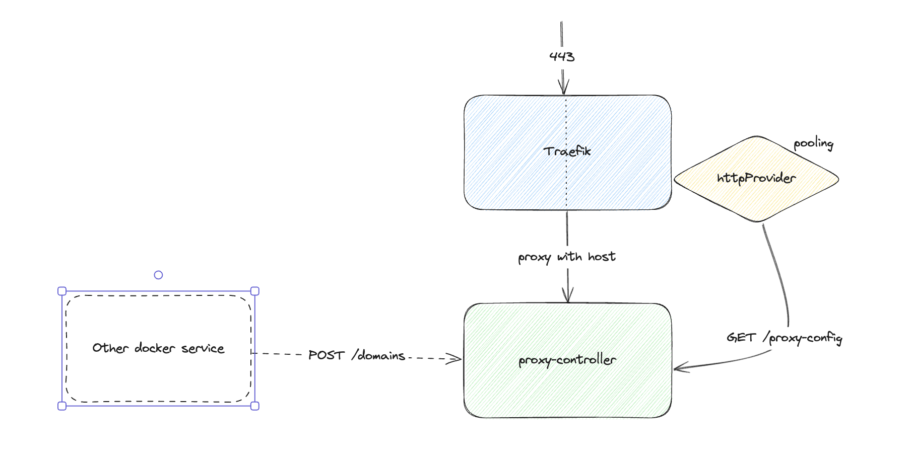

# Dynamic treafik proxy

This demo is showing the example of simple server (`proxy-controller`), which is able to control the traefik proxy dynamically using HTTP provider.

> This example could be useful for developers who are looking for the way to enable custom domains in their systems.

> Remember, this is just an example. You can build your own system using this demo as an example but pls, do not use it in production as it is. 




### Deploy

1. Change the `IP_ADDRESS` env in the docker compose. It should be your public address
2. Enable the swarm mode on your machine
3. Then run the commands below
   ```bash
   docker config create traefik ./traefik.yml
   docker stack deploy -c ./docker-compose.yml dynamic
   ```

### Build proxy-controller

```bash
# Build image
docker build -t andriideveloper/dynamic-traefik-config-manager:latest --platform linux/amd64 ./proxy-controller
# Publish image
docker push andriideveloper/dynamic-traefik-config-manager:latest
```

### Proxy controller commands

> Proxy controller could save domain (which is pointing to the `IP_ADDRESS`), return the config for Traefik in the yaml format and also to return custom message for each `Host`.****

1. Read proxy config
   ```bash
   curl -X GET http://localhost:3000/proxy-config
   ```

2. Add domain to proxy config
   ```bash
   curl -X POST --data '{ "domain": "example.com" }' -H 'Content-Type: application/json' http://localhost:3000/domains
   ```
